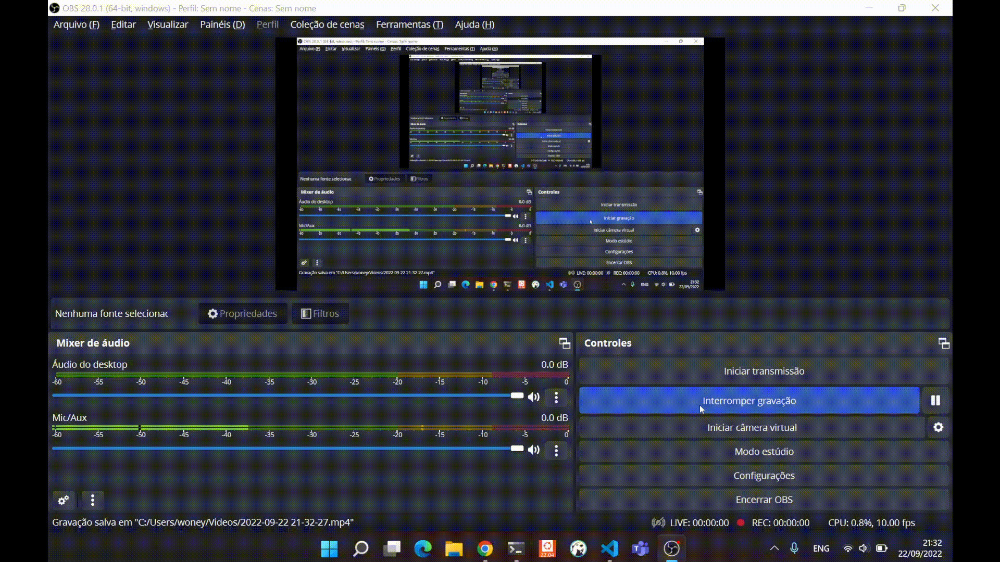

# Lara-PlantUML

A Lib plantUML é umz lib poderosa para a geração de vários tipos de diagramas.

aqui tempos um exemplo de implementação desta biblioteca em um componente livewire;


para verificar todas as possibilidades, acessar: https://plantuml.com/

passos para reprodução:
```
git clone
composer install
nmp install
npm run build
./vendor/bin/sail up -d
php artisan migrate
acessar página...
```
funcionamento:
 - escrevemos codigo para desenhar nosso diagrama alvo;
 - livewire converte nosso codigo no formato aceito pelo plantUML server;
 - injetamos na nossa figura o código gerado e é isso! 

free to fly!
